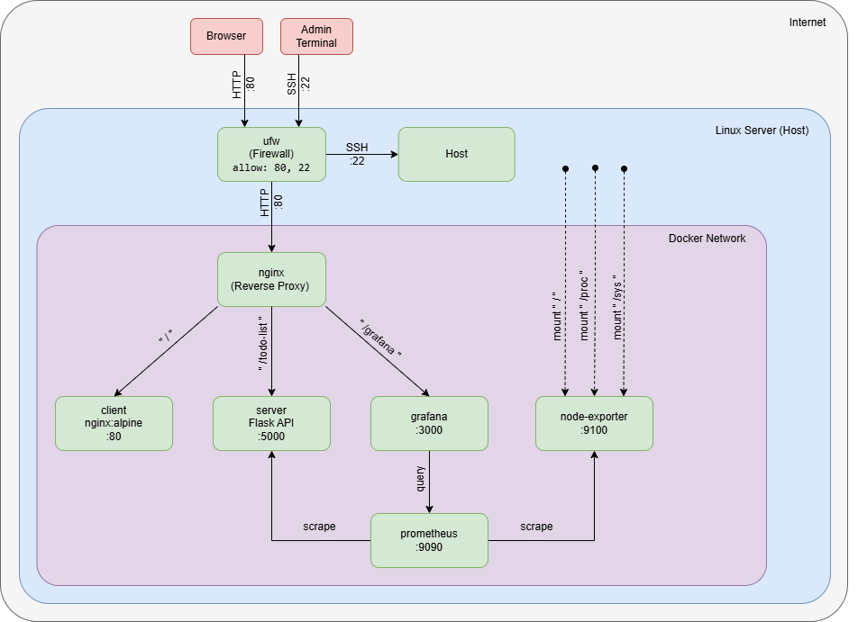

# Todo List App (v1.0.0)

A full-stack Todo application with a Vanilla JavaScript frontend and a Python/Flask REST API backend. All services run containerized via Docker Compose and are accessible through an nginx reverse proxy. The stack includes infrastructure monitoring via Prometheus and Grafana.

## Architecture



All services share a Docker network (`docker-net`). nginx is the only service exposed to the host on port 80 — all other containers are reachable within the network only.

| Service | Image | Description |
|---|---|---|
| nginx | nginx:alpine | Reverse proxy, routes traffic to client and server |
| client | nginx:alpine | Serves the static frontend |
| server | custom | Flask REST API |
| prometheus | prom/prometheus | Scrapes metrics from Flask and node-exporter |
| node-exporter | prom/node-exporter | Exposes host system metrics (CPU, RAM, Disk) |
| grafana | grafana/grafana | Metrics visualization dashboard |

---

## Server Setup

> Tested on **Ubuntu 26.04 LTS** (64-bit).

All steps are performed on the command line. A terminal text editor is required — install one if not already present:

```bash
sudo apt install -y nano
```

### 1. User Management

```bash
sudo adduser appuser
sudo adduser sysadmin
sudo usermod -aG sudo sysadmin
```

`sysadmin` is added to the `sudo` group for administrative tasks. `appuser` remains an unprivileged user.

### 2. SSH

Install OpenSSH server if not already present (required on local VMs; usually pre-installed on cloud instances):

```bash
sudo apt install -y openssh-server
```

Restrict SSH access to `sysadmin` only to reduce the attack surface:

```bash
sudo nano /etc/ssh/sshd_config
```

Add:

```
AllowUsers sysadmin
```

Restart SSH:

```bash
sudo systemctl restart sshd
```

### 3. Static IP Address (VirtualBox only)

> **This step only applies when running on a VirtualBox VM with a Bridged Adapter.** Skip if deploying on a physical server or cloud instance with a pre-assigned static IP.

In VirtualBox, set the network adapter to **Bridged Adapter** so the VM receives an IP in the same subnet as the host. Then configure a static IP inside the VM using `netplan`:

```bash
sudo apt install -y netplan.io
ls /etc/netplan/
```

Open the config file shown (e.g. `00-installer-config.yaml`):

```bash
sudo nano /etc/netplan/00-installer-config.yaml
```

Replace the contents with:

```yaml
network:
  version: 2
  ethernets:
    enp0s3:                     # ← replace with your interface name (check with: ip link)
      dhcp4: no
      addresses:
        - 192.168.1.100/24      # ← your desired static IP and subnet
      routes:
        - to: default
          via: 192.168.1.1      # ← your gateway (usually the router IP)
      nameservers:
        addresses: [8.8.8.8, 1.1.1.1]
```

Apply the configuration:

```bash
sudo netplan apply
```

Verify the IP was applied:

```bash
ip addr show
```

### 4. Firewall

Only SSH (22) and HTTP (80) are allowed — all other ports, including Grafana (:3000) and Prometheus (:9090), remain closed and are only accessible through the nginx reverse proxy:

```bash
sudo ufw allow OpenSSH
sudo ufw allow 80/tcp
sudo ufw enable
```

### 5. Docker

```bash
sudo apt update
sudo apt install -y docker.io docker-compose-v2
sudo systemctl enable docker
sudo systemctl start docker
```

Add `sysadmin` to the `docker` group to run Docker without `sudo`:

```bash
sudo usermod -aG docker sysadmin
```

Log out and back in for the group change to take effect.

---

## Deployment

### 1. Clone the Repository

```bash
sudo apt install -y git
git clone https://github.com/c-stuermer/lf9-todo-app
cd lf9-todo-app
```

### 2. Configuration

Grafana requires the server's domain or IP to generate correct redirect URLs:

```bash
nano docker-compose.yml
```

```yaml
- GF_SERVER_DOMAIN=your-domain-or-ip
- GF_SERVER_ROOT_URL=http://your-domain-or-ip/grafana/
```

### 3. Start Services

```bash
docker compose up -d
```

All containers start automatically after a reboot (`restart: always`).

| Service | URL |
|---|---|
| App | `http://<server-ip>` |
| Grafana | `http://<server-ip>/grafana/` |

### 4. Grafana Initial Login

Open Grafana and log in with the default credentials:

- **Username:** `admin`
- **Password:** `admin`

Prometheus is pre-configured as the default data source. Both dashboards (Flask API metrics and host system metrics) are provisioned automatically on first start.

---

## Stop All Services

```bash
docker compose down
```

---

## API

The full REST API specification is documented in [`server/openapi.yaml`](server/openapi.yaml).

---

## Project Structure

```
/
├── client/                         # Frontend (HTML, CSS, Vanilla JS)
│   ├── index.html
│   ├── styles.css
│   ├── app.js
│   ├── config.js
│   └── Dockerfile
├── server/                         # REST API (Python, Flask)
│   ├── server.py
│   ├── requirements.txt
│   ├── Dockerfile
│   └── openapi.yaml
├── nginx/
│   ├── nginx.conf
│   └── includes/
│       ├── app.conf                # Routes: / and /todo-list
│       └── monitoring.conf         # Routes: /grafana
├── prometheus/
│   └── prometheus.yml
├── grafana/
│   └── provisioning/
│       ├── dashboards/
│       └── datasources/
├── docs/
│   └── server_architecture.drawio.png
└── docker-compose.yml
```